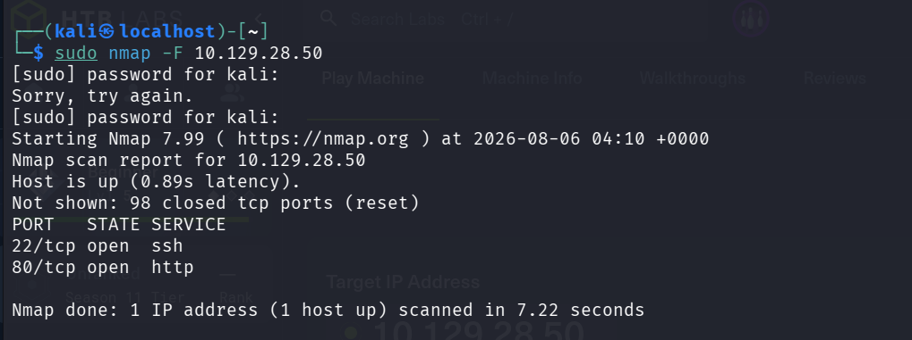
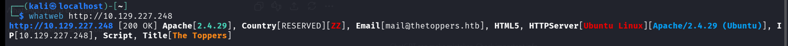
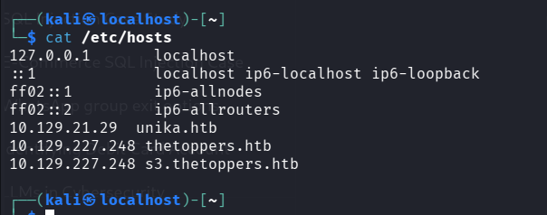
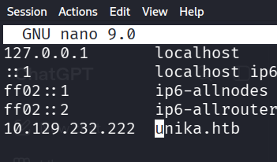
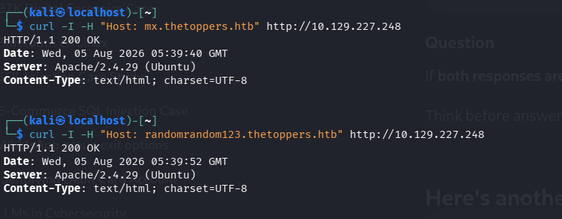
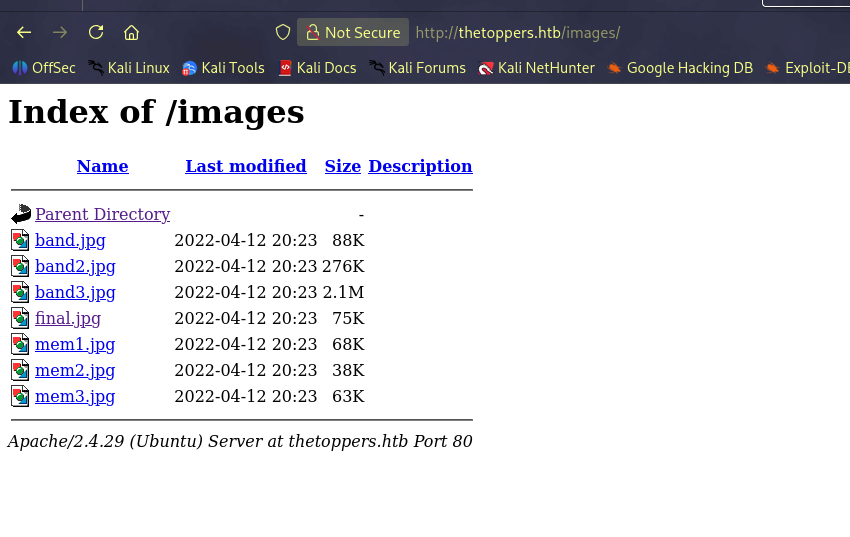

# Lesson 2 — Web Reconnaissance & HTTP Fundamentals

## Objective

Lesson 2 focuses on the first stage of web application assessment: identifying a reachable web service, understanding how the target is resolved, fingerprinting the web stack, inspecting HTTP responses, and recognizing common Apache behavior before moving into request interception with Burp Suite.

This report is based on the screenshots and terminal output captured during the lab work.

## Learning outcomes

By the end of this lesson, we can:

- Identify HTTP services exposed by a target.
- Understand the role of ports, especially TCP/80 for HTTP.
- Map lab IP addresses to hostnames using `/etc/hosts`.
- Fingerprint a web application using `whatweb`.
- Inspect HTTP response headers with `curl`.
- Recognize Apache/Ubuntu server fingerprints.
- Identify Apache's default document root behavior.
- Recognize directory listing behavior and exposed files.
- Distinguish between hostname resolution, web-server behavior, and application content.

---

## 1. Discovering the web service

The first step is to establish what network services are available on the target. The captured Nmap result shows two open TCP services: SSH on port 22 and HTTP on port 80.



The important web-testing observation is:

```text
80/tcp open http
```

This confirms that the target exposes a web service and gives us a starting point for browser and HTTP-tool enumeration.

---

## 2. Technology fingerprinting with WhatWeb

Once HTTP is identified, `whatweb` can be used to collect high-level technology information from the HTTP response.



The captured output identifies information including:

- HTTP status: `200 OK`
- Web server: Apache
- Apache version string: `Apache/2.4.29 (Ubuntu)`
- Operating-system/server hint: Ubuntu Linux
- HTML5 content
- Page title: `The Toppers`
- A contact/email string exposed by the page

Fingerprinting does not automatically prove a vulnerability. Its purpose is to build an accurate picture of the target so later testing can be focused and evidence-driven.

Example command:

```bash
whatweb http://TARGET
```

---

## 3. Hostname resolution with `/etc/hosts`

Web applications may behave differently depending on the hostname sent in the HTTP `Host` header. In lab environments, the required hostname is often mapped manually in `/etc/hosts`.



The captured hosts file contains mappings for lab systems including `unika.htb`, `thetoppers.htb`, and `s3.thetoppers.htb`.

A hosts-file entry follows the pattern:

```text
IP_ADDRESS hostname
```

The hostname can then be used directly in the browser or with tools such as `curl` and `whatweb`.

The second screenshot shows the hosts file being edited directly.



This step is important because an IP address alone may reach the web server while a named virtual host may be required to reach the intended application.

---

## 4. Inspecting HTTP response headers with cURL

`curl` provides a direct way to inspect how the server responds without relying on browser rendering.



From the captured response headers, we can identify values such as:

```text
HTTP/1.1 200 OK
Server: Apache/2.4.29 (Ubuntu)
Content-Type: text/html; charset=UTF-8
```

This information answers three useful questions immediately:

1. Did the request succeed?
2. What server software is responding?
3. What type of content is being returned?

Common commands used during this phase include:

```bash
curl http://HOST
curl -I http://HOST
curl -v http://HOST
```

`-I` requests response headers, while `-v` provides additional request/response connection details.

---

## 5. Understanding Apache default behavior

The supplied terminal capture of `curl http://127.0.0.1` returned the standard Apache2 Debian default page. The page explicitly states that the default Debian document root is:

```text
/var/www/html
```

This is useful because it explains the relationship between the URL requested by a browser and the files Apache serves from disk.

Conceptually:

```text
Browser request
      |
      v
http://127.0.0.1/
      |
      v
Apache web server
      |
      v
/var/www/html/index.html
```

The captured default page also describes the common Apache configuration layout under `/etc/apache2/`, including `apache2.conf`, `ports.conf`, `mods-enabled`, `conf-enabled`, and `sites-enabled`.

The raw terminal output from this exercise is preserved in:

```text
evidence/apache-localhost-curl-output.txt
```

---

## 6. Directory listing and exposed content

A web server may expose a directory index when no index document blocks directory browsing and indexing is enabled.



The captured Apache `Index of /images` page exposes filenames in the directory. Directory listings can reveal application structure, naming conventions, backups, media files, or other resources that were not intended to be discovered through normal navigation.

During enumeration, directory listings should be treated as information disclosure and reviewed carefully rather than assumed to be harmless.

---

## 7. HTTP concepts reinforced in this lesson

### URL and hostname

A URL such as:

```text
http://thetoppers.htb/images/
```

contains the scheme (`http`), hostname (`thetoppers.htb`), and path (`/images/`).

### Port

HTTP normally uses TCP port 80 unless another port is explicitly specified.

### Request

The client sends an HTTP request containing a method, path, headers, and sometimes a body.

### Response

The web server returns a status code, headers, and usually a response body.

### Status code

`200 OK` indicates that the server successfully processed the request.

### Server header

The `Server` response header may reveal the underlying web-server software and sometimes its version.

### Host header / virtual hosts

A single server IP can host multiple websites. The hostname supplied by the client can determine which virtual host Apache serves.

---

## 8. Workflow learned

The practical workflow for this lesson is:

```text
Target IP
   |
   v
Nmap service discovery
   |
   v
Identify HTTP/HTTPS
   |
   v
Resolve required hostname
   |
   v
WhatWeb technology fingerprinting
   |
   v
cURL request/header inspection
   |
   v
Browser-based content review
   |
   v
Record interesting paths, files, headers and technologies
```

This workflow provides the foundation for Lesson 3, where Burp Suite is placed between the browser and the server so individual HTTP requests can be captured, modified, and replayed.

---

## 9. Key takeaways

- Port scanning tells us *where* a web service is exposed.
- Hostname resolution tells our client *which named site* to request.
- WhatWeb helps identify the technology stack.
- cURL lets us inspect raw HTTP behavior directly.
- Apache default pages and directory listings can reveal useful server configuration and content structure.
- Reconnaissance should produce evidence and hypotheses, not assumptions about vulnerabilities.

## Scope note

All commands and observations in this report are intended for authorized labs, CTF environments, or systems where explicit permission has been granted.
