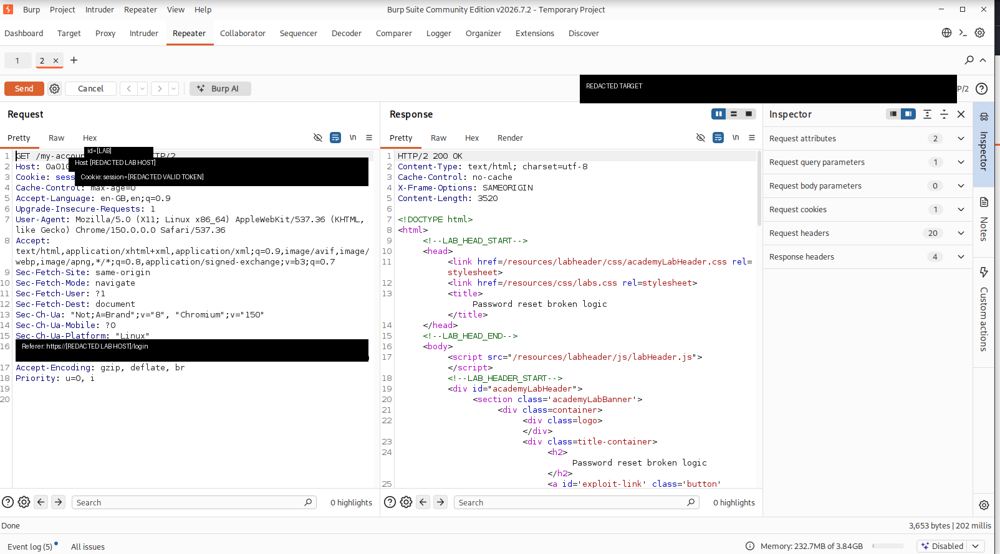
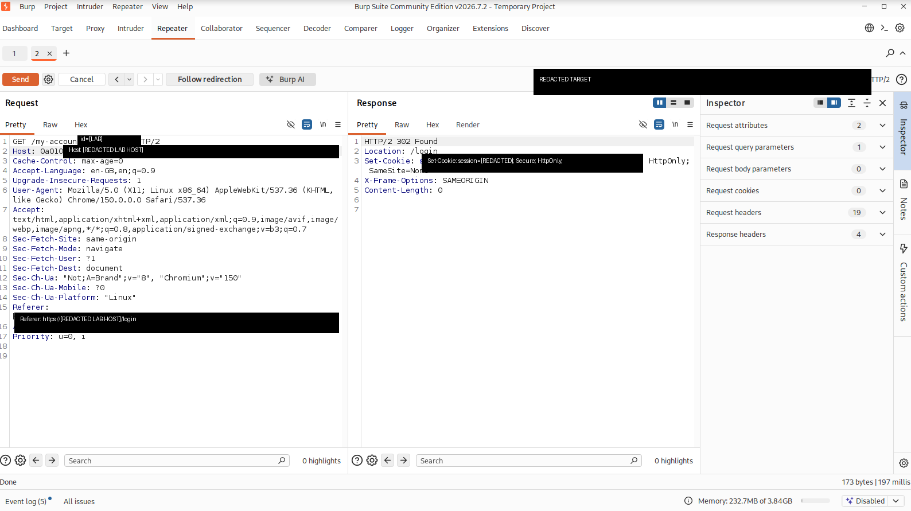
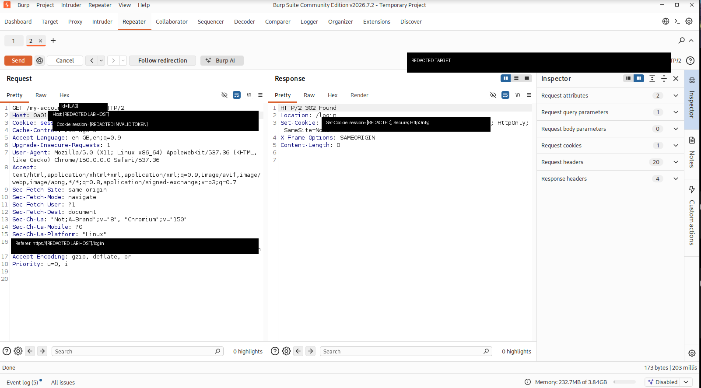
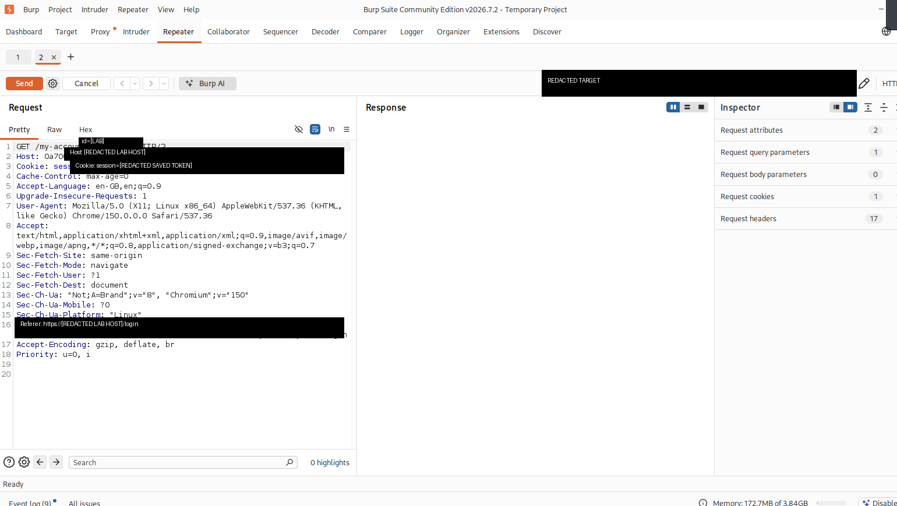
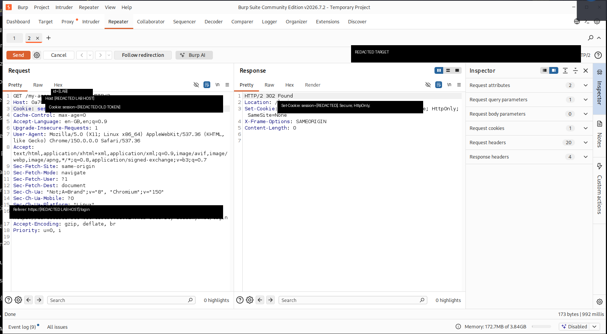

# Authentication & Session Handling — Burp Suite Lab Report

> **Scope:** intentionally vulnerable training application only.  
> **Tooling:** Burp Suite Community Edition — Proxy / HTTP history / Repeater.  
> **Evidence policy:** session tokens and lab-specific hostnames are redacted from all committed screenshots.

## Objective

Map the authentication lifecycle and verify how the application treats valid, missing, invalid, and logged-out session identifiers.

```text
Login
  ↓
Authenticated request
  ↓
Session cookie
  ↓
Remove / alter cookie
  ↓
Compare server behavior
  ↓
Logout
  ↓
Replay previous authenticated session
```

## Test flow

### 1. Valid authenticated session

A saved authenticated request to `/my-account` was replayed with the valid session cookie intact.

**Observed result:** `HTTP/2 200 OK`.



This establishes the control case: the server accepts the valid session identifier and returns the authenticated account page.

---

### 2. Request without a session cookie

The same authenticated endpoint was requested after removing the `Cookie: session=...` header.

**Observed result:** `HTTP/2 302 Found` with `Location: /login`.



This shows that the account identifier in the URL is not sufficient to authenticate the request. The authenticated session state is required.

---

### 3. Request with an invalid session token

A deliberately invalid value was supplied in the session cookie while keeping the rest of the request unchanged.

**Observed result:** `HTTP/2 302 Found` with `Location: /login`. The application issued a new unauthenticated session cookie.



The server rejected the unrecognized token rather than treating it as an authenticated session.

---

### 4. Preserve the authenticated session before logout

The authenticated session value was saved in Repeater before logging out so that the same token could be replayed afterward.



This step is important because browser-side cookie deletion alone does not prove server-side invalidation.

---

### 5. Replay the old authenticated session after logout

After logging out normally in the browser, the previously valid authenticated session identifier was pasted back into the saved Repeater request and replayed against `/my-account`.

**Observed result:** `HTTP/2 302 Found` with `Location: /login`.



This confirms that the old authenticated session was no longer accepted after logout.

## Results

| Test | Session state | Result | Interpretation |
|---|---|---|---|
| Authenticated control | Valid authenticated token | `200 OK` | Authenticated session accepted |
| Cookie removed | No session token | `302 → /login` | Authentication required |
| Cookie modified | Invalid token | `302 → /login` | Invalid session rejected |
| Old token after logout | Previously valid token | `302 → /login` | Logout invalidated authenticated session |

## Confirmed observations

- The application uses a `session` cookie to maintain authenticated state.
- A valid authenticated session provides access to the protected account endpoint.
- Removing the session cookie causes the application to redirect to login.
- Supplying an invalid session value also causes a redirect to login.
- The server may create a new unauthenticated session when an invalid or absent session reaches the protected endpoint.
- The observed cookie attributes included `Secure`, `HttpOnly`, and `SameSite=None`.
- Replaying the exact authenticated session that had been saved before logout did **not** restore authenticated access.
- Therefore, logout invalidation was confirmed in this test.

## Not yet tested

The following should **not** be treated as findings from this exercise:

- session rotation immediately after login;
- session fixation resistance;
- idle timeout;
- absolute timeout;
- concurrent session behavior;
- token entropy/predictability;
- remember-me behavior;
- MFA/session transitions.

These require separate controlled tests.

## Security interpretation

The logout behavior observed here is the expected secure design:

```text
Valid authenticated session
        ↓
Protected resource → 200

        LOGOUT
          ↓

Replay old session
        ↓
Protected resource → 302 /login
```

A weaker implementation would only remove the cookie from the browser while leaving the corresponding server-side session valid. In that situation, replaying the captured token could still return authenticated content. That was **not** observed in this test.

## Methodology notes

Each Repeater test changed one relevant variable at a time:

1. retain the valid authenticated cookie;
2. remove the cookie;
3. replace it with an invalid value;
4. save the valid authenticated token;
5. log out;
6. replay that exact saved token.

This control-based approach makes the observed authentication decision easier to attribute to the session state rather than unrelated request differences.

## Repository safety

All evidence in this repository is sanitized. Do not commit:

- live session tokens;
- passwords or reset tokens;
- CSRF tokens where disclosure is unnecessary;
- private lab instance URLs;
- Burp project files containing raw traffic;
- production credentials.

See [`SECURITY.md`](SECURITY.md) for handling guidance.

## Next exercise

The next useful test is **session rotation at login**:

```text
Pre-login session A
      ↓
Successful login
      ↓
Authenticated session B
```

Record both identifiers and verify whether `A != B`. This should be documented as an observation first; session fixation should only be reported after a dedicated fixation test.
