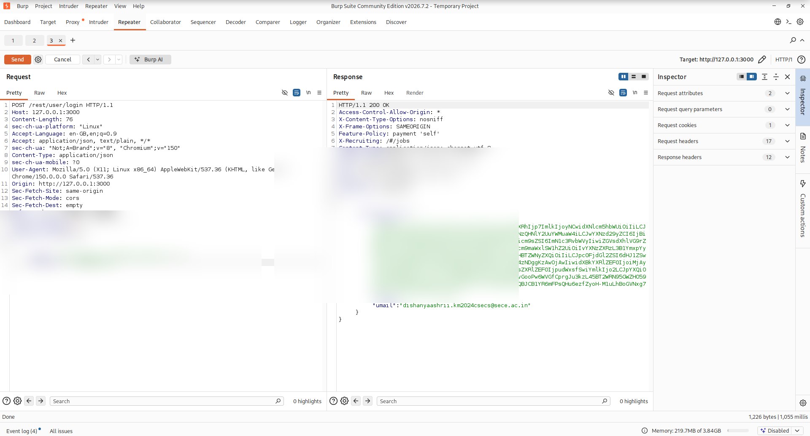
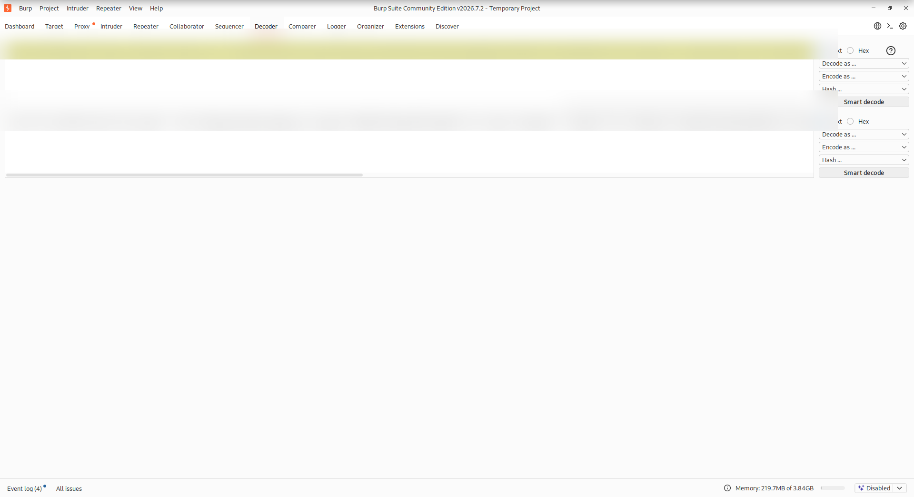

# Burp Suite Lesson 3 — Decoder, Encoding, Repeater & JWT 🦊

> Training environment: **OWASP Juice Shop on localhost** with Burp Suite Community Edition.  
> Scope: local/intentionally vulnerable lab only.

## Completed topics

- URL encoding and decoding
- Base64 encoding and decoding
- HTML entity encoding
- chained/double encoding
- Burp Repeater parameter manipulation
- URL-encoded Juice Shop search parameters
- SHA-256 hashing demonstration
- JWT structure and Base64URL decoding concepts
- safe screenshot redaction for public GitHub notes

## 1. URL encoding

Example:

```text
admin%40example.com
↓
admin@example.com
```

`%40` represents `@`.

.png)

A Juice Shop search request was also replayed with an encoded value:

```http
GET /rest/products/search?q=%61%70%70%6c%65 HTTP/1.1
Host: localhost:3000
```

The application decoded the value as `apple` and returned the same matching products.

.png)

## 2. Base64

```text
admin:password123
↓ Base64
YWRtaW46cGFzc3dvcmQxMjM=
```

.png)

Reverse:

```text
dXNlcjpzdXBlcnNlY3JldA==
↓ Base64 decode
user:supersecret
```

.png)

**Lesson:** Base64 is encoding, not encryption.

## 3. HTML encoding

Burp can represent special HTML characters using numeric entities such as:

```text
&#x3c; → <
&#x3e; → >
```

.png)

## 4. Chained encoding

```text
admin
↓ Base64
YWRtaW4=
↓ URL encode
%59%57%52%74%61%57%34%3d
```

.png)

When decoding chained values, reverse the order.

## 5. Repeater + Juice Shop

The practical workflow:

```text
Browser → Proxy/HTTP History → Repeater → Modify → Send → Compare
```

A product search request:

```http
GET /rest/products/search?q=apple HTTP/1.1
```

returned JSON product data.

.png)

## 6. Hashing vs encoding

Encoding is reversible. Hashing is designed to be one-way.

SHA-256 was demonstrated with two similar inputs:

```text
password123
password124
```

The outputs changed dramatically, demonstrating the **avalanche effect**.

.png)

.png)

> For real password storage, use dedicated password-hashing functions such as Argon2id, bcrypt, scrypt, or PBKDF2 with salts.

## 7. JWT basics

A JWT is commonly structured as:

```text
HEADER.PAYLOAD.SIGNATURE
```

- **Header**: token metadata, e.g. type/algorithm
- **Payload**: claims/application data
- **Signature**: cryptographic integrity/authenticity data

The first two sections are generally Base64URL-encoded, not encrypted.





**Lesson:** JWT payload contents may be readable by anyone who possesses the token. The signature is what protects integrity when verification is implemented correctly.

## 8. Reporting hygiene

Before publishing Burp screenshots, redact:

- passwords
- email addresses if private
- cookies/session IDs
- JWT/Bearer tokens
- API keys
- reset tokens
- authorization headers

This package excludes or redacts sensitive values from the uploaded screenshots.

## Status

**Burp fundamentals: COMPLETE ✅**  
**Decoder / encoding basics: COMPLETE ✅**  
**JWT structure/decoding concept: COMPLETE ✅**

Next step: move into vulnerability-focused labs and learn additional Burp tools when they become relevant.
