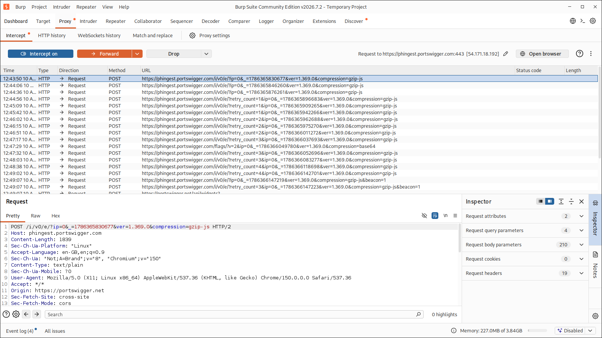
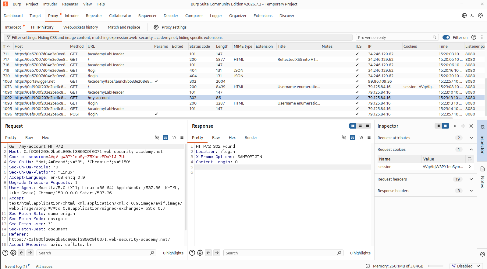
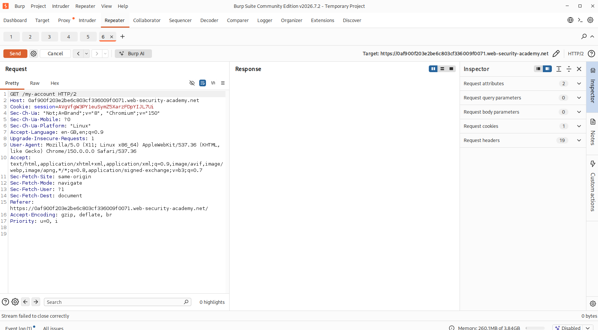
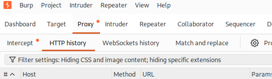

# Burp Suite Lesson 3 — HTTP Traffic, Repeater, Parameters, Sessions & Scope 🦊

> **Training context:** PortSwigger Web Security Academy / intentionally vulnerable lab targets only.  
> **Purpose:** Build a practical foundation for understanding and manipulating HTTP requests with Burp Suite.

## Learning objectives

By the end of this lesson, I can:

- Explain what a proxy is and where Burp sits in the traffic flow.
- Capture HTTP requests with Burp Proxy.
- Read request lines, headers, cookies, and bodies.
- Distinguish GET query parameters from POST body parameters.
- Send requests to Repeater, modify them, resend them, and compare responses.
- Read common HTTP status codes and redirects.
- Understand the basic role of cookies and session identifiers.
- Use HTTP History and Target Scope to reduce noise and focus on the authorized target.

---

## 1. Burp Suite proxy fundamentals

Normal browsing:

```text
Browser ─────────────► Web Server
```

With Burp:

```text
Browser ──► Burp Proxy ──► Web Server
```

Burp acts as an intercepting proxy between the browser and the server.

### Intercept ON vs OFF

- **Intercept ON** — Burp pauses matching requests so they can be inspected, modified, forwarded, or dropped.
- **Intercept OFF** — requests continue normally, but Burp can still record them in **Proxy → HTTP history**.

Core workflow:

```text
Browser → Capture → Inspect → Repeater → Modify → Send → Compare
```

---

## 2. Capturing and reading requests

A request line may look like:

```http
GET /web-security/dashboard HTTP/2
Host: portswigger.net
```

Breakdown:

- `GET` — HTTP method
- `/web-security/dashboard` — path
- `HTTP/2` — protocol version
- `Host` — target host

A modern page can generate many background requests, including telemetry, analytics, scripts, and APIs.



---

## 3. GET vs POST

### GET example

```http
GET /search?q=saree HTTP/2
```

Here the parameter is in the URL/query string:

```text
q=saree
```

General syntax:

```text
/path?parameter=value&parameter2=value2
```

### POST example

```http
POST /login HTTP/2
Content-Type: application/x-www-form-urlencoded

username=test&password=best
```

Here the parameters are in the **request body**:

```text
username=test
password=best
```

A POST request can also still contain query parameters in its URL.

---

## 4. Burp Repeater

Repeater makes it possible to resend the same request manually without repeating the browser action.

Typical method:

1. Capture/find a request.
2. Right-click → **Send to Repeater**.
3. Send the original request once to establish a baseline.
4. Change **one thing at a time**.
5. Send again.
6. Compare:
   - status code
   - response length
   - headers
   - response body
   - redirect location
   - timing

Example:

```text
Original:
GET /web-security/dashboard
→ 200 OK

Modified:
GET /web-security/this-page-does-not-exist-12345
→ 404 Not Found
```

This demonstrates that changing the path changes the request the server receives.

---

## 5. HTTP response basics

Important status codes encountered or discussed:

| Code | Meaning |
|---|---|
| `200 OK` | Request handled successfully |
| `302 Found` | Redirect |
| `403 Forbidden` | Server refuses access |
| `404 Not Found` | Resource not found |
| `500 Internal Server Error` | Server-side failure |

Important lesson:

> `200 OK` does **not** necessarily mean a login succeeded. It only means the HTTP request was handled and a response was returned.

A login response can be `200 OK` while the body still says:

```text
Invalid username
```

### Redirect example

```http
HTTP/2 302 Found
Location: /login
```

Flow:

```text
GET /my-account
        ↓
302 Found
Location: /login
        ↓
GET /login
        ↓
200 OK
```

---

## 6. Cookies and sessions

A cookie may be sent as:

```http
Cookie: session=<session-id>
```

The server can use a session identifier to associate a request with server-side state.

Conceptually:

```text
Browser
  │
  │ Cookie: session=ABC123
  ▼
Server
  │
  ├─ Is the session valid?
  ├─ Which session is it?
  └─ Is it authenticated?
```

A cookie and a session are related but not identical:

- **Cookie** — browser-stored data sent with applicable requests.
- **Session** — application/server state used to recognize a client across requests.

> **Security note:** Never publish session cookies or authentication tokens in screenshots or reports.

---

## 7. HTTP History and filtering

HTTP History is often more practical than leaving Intercept ON constantly.

Workflow:

```text
Browse normally
    ↓
HTTP History records traffic
    ↓
Filter noise
    ↓
Find interesting request
    ↓
Send to Repeater
```

Burp can hide static resources such as images, fonts, and CSS.





Useful beginner filters include:

- **Show only in-scope items**
- **Show only parameterized requests**
- Hide static file extensions
- Filter by status code
- Filter by search term

---

## 8. Target Scope

Scope tells Burp which systems are part of the authorized testing target.

Example:

```text
All browser traffic
├── web-security-academy.net  ← in scope
├── youtube.com
├── analytics domains
├── CDNs
└── other background traffic
```

After adding the lab to scope, Burp can avoid accumulating unrelated traffic.



This also helps avoid accidentally sending unrelated third-party traffic to Repeater.

---

## 9. Practical lessons learned

- The browser UI is not the security boundary; the server must validate every request.
- GET and POST describe request methods, not whether a request is "safe" or "secret."
- POST bodies can contain form data, JSON, or other content types.
- One request can contain both URL query parameters and a body.
- Repeater is most useful when changing one variable at a time.
- Response differences can appear in status code, body text, headers, size, or timing.
- Browsers often follow redirects automatically; Burp exposes the intermediate `302`.
- HTTP History and Scope are essential for separating useful traffic from noise.

---

## 10. Remaining Lesson 3 topics

Next:

- URL encoding (`%20`, `%2F`, `%3D`, etc.)
- Base64 recognition and decoding
- HTML encoding
- Burp Decoder
- Numeric IDs
- Boolean values
- Hidden form parameters
- JSON request bodies
- Removing / adding parameters
- Final mini-lab combining the full workflow

Final target workflow:

```text
Browse
  ↓
HTTP History
  ↓
Find interesting request
  ↓
Inspect parameters
  ↓
Send to Repeater
  ↓
Modify one value
  ↓
Send
  ↓
Compare response
```

---

## Safety / scope

This report documents exercises performed for learning purposes using:

- PortSwigger Web Security Academy
- intentionally vulnerable labs
- explicitly authorized targets

Do not reuse the same active-testing workflow against production systems without permission.

