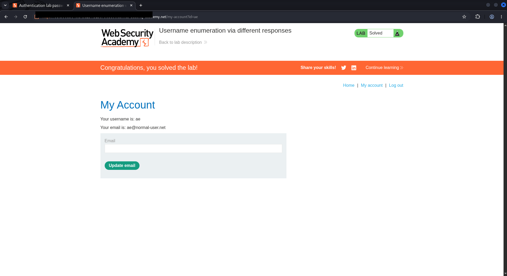

# Username Enumeration via Different Responses

> **PortSwigger Web Security Academy --- Authentication Lab**\
> A short write-up showing how a tiny difference in an application's
> login responses can become a reliable username-enumeration oracle.


## TL;DR

The login endpoint leaked account validity through **different
responses**. Instead of treating every failed login identically, the
application returned one message for an unknown username and another for
a valid username with a wrong password.

That difference was enough to turn the login form into an oracle:

``` text
candidate username
      │
      ▼
 POST /login
      │
      ├── "Invalid username"   → reject candidate
      │
      └── "Incorrect password" → username exists
                                      │
                                      ▼
                              test password candidates
                                      │
                                      └── 302 redirect → authenticated
```

The interesting part was not a flashy payload. It was recognizing that
**response semantics and status codes were data**.

------------------------------------------------------------------------

## Lab Objective

Identify a valid username, determine its password from the supplied lab
wordlists, authenticate as that user, and confirm the lab is solved.

> \[!NOTE\] This repository documents activity performed only against
> the intentionally vulnerable **PortSwigger Web Security Academy** lab
> environment. Ephemeral hostnames, session cookies, and submitted
> credential values have been redacted from the screenshots.

## Recon: Establishing the Failure Modes

I first sent a normal login request through Burp Suite and observed the
application's response to a username that did not exist.


The key response was:

``` text
Invalid username
```

That wording matters. A secure login flow should avoid revealing whether
the username or password was the incorrect component.

## Finding the Username Oracle

Next, I used **Burp Intruder** to place the payload position on the
`username` parameter and tested the provided username candidates while
keeping the password deliberately incorrect.

Most responses had the same shape. One candidate produced a different
response message:


``` text
Incorrect password
```

That single wording change confirms that the application recognizes the
username. At this point the problem changes from:

> "Which account exists?"

to:

> "Which password authenticates this known account?"

### Why this is exploitable

The server is effectively exposing a boolean condition:

  Response                         Meaning
  -------------------------------- --------------------------
  `Invalid username`               Username does not exist
  `Incorrect password`             Username exists
  `302 Found` + account redirect   Authentication succeeded

This is a classic **username enumeration via response discrepancy**.

## Password Phase: Let the Outlier Speak

With the valid username identified, I moved the Intruder payload
position to the `password` parameter and tested the supplied password
candidates.

The useful signal was no longer just the body text. One result broke
away from the surrounding `200` responses and returned a **`302`
redirect** with a much shorter response.


Inspecting that response showed the application redirecting to the
account page and issuing a fresh authenticated session cookie:


``` http
HTTP/2 302 Found
Location: /my-account?id=<user>
Set-Cookie: session=<REDACTED>; Secure; HttpOnly; SameSite=None
```

The status-code and response-length anomaly made the successful attempt
easy to isolate.

## Proof of Success

Following the redirect opened the authenticated account page, and the
lab marked the challenge as solved.



**Result:** lab solved successfully.

------------------------------------------------------------------------

## Attack Flow

``` text
1. Capture POST /login
2. Send request to Intruder
3. Fuzz username parameter
4. Compare response messages
5. Identify "Incorrect password" outlier
6. Fix the valid username
7. Fuzz password parameter
8. Compare status code / response length
9. Identify 302 redirect
10. Follow authenticated redirect
11. Lab solved
```

## What Made the Vulnerability Possible?

The weakness is not merely that the server returns an error. It is that
it returns **distinguishable authentication outcomes** before
authentication has succeeded.

An attacker can automate those differences at scale. Even small
variations can become enumeration signals, including:

-   different error text;
-   different HTTP status codes;
-   different response lengths;
-   redirects;
-   timing differences; or
-   different lockout behavior.

Here, the application disclosed enough information in the error message
to identify a real account, then exposed a clear redirect when the
correct password was supplied.

## Defensive Takeaways

Applications should make failed authentication responses as
indistinguishable as practical. A safer design uses a generic message
such as:

``` text
Invalid username or password.
```

The response status, body structure, timing characteristics, and
surrounding behavior should also be kept consistent. Rate limiting,
monitoring, MFA, and strong password policies add useful layers, but
they do not replace fixing the enumeration signal itself.

## Evidence Hygiene

Before publishing this write-up, the screenshots were sanitized to
remove:

-   ephemeral Web Security Academy lab hostnames;
-   session cookie values;
-   submitted credential values where they appeared in raw requests; and
-   authenticated session tokens.

The intentionally vulnerable lab username may remain visible where it is
necessary to explain the finding; it is not a real-world account.

## Lessons Learned

The biggest lesson from this lab is simple: **look for differences, not
just errors**.

A `200` response is not automatically a failure, a `302` is not
automatically noise, and two visually similar login failures may encode
completely different server-side decisions. Burp Intruder becomes much
more useful when response **status, length, wording, and redirects** are
treated as signals rather than just output.

------------------------------------------------------------------------

### Repository layout

``` text
.
├── README.md
└── assets/
    ├── 01-login-request.png
    ├── 02-invalid-password.png
    ├── 03-success-redirect.png
    ├── 04-intruder-anomaly.png
    └── 05-lab-solved.png
```

### Disclaimer

This write-up is for education and authorized security testing only. The
demonstrated technique was performed in a deliberately vulnerable
training environment.
